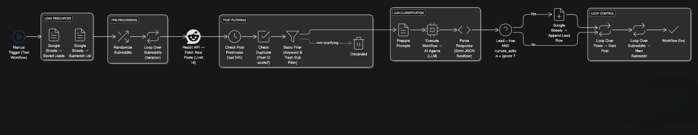

# Reddit Lead Extractor — n8n Automation

A production-ready n8n automation system that scans multiple subreddits, fetches fresh posts, filters them with strict keyword rules, qualifies them with an LLM, parses JSON safely, removes duplicates, and stores confirmed leads directly in Google Sheets.

This workflow consistently identifies real paid leads for backend work, automation, cloud setups, AI agents, and web applications.

---

## 🧩 Features

- Google Sheets → dynamic list of subreddits
- Smart rotation & randomization of subreddits
- Fetches latest posts from each subreddit
- Filters irrelevant/non-paid posts using hard rules
- Checks post freshness (last 24 hours)
- Avoids duplicates using stored post IDs
- Strict LLM-based lead classification using structured JSON
- Automatic JSON sanitization and validation
- Stores qualified leads into Google Sheets
- Ready to plug into Gmail, Telegram, or outreach automations

---

## 🔎 What This Lead Extractor Actually Detects

A post is considered a lead only if it:

- Explicitly or strongly implies they are hiring
- Mention payment, budget, or freelancer intent
- Relates to:
    - n8n / Zapier / automation
    - backend development
    - API integration
    - AI agents / chatbots / RAG systems
    - cloud setups (AWS, Firebase)
    - Next.js / Node.js web development
- Does not come from trash subs
- Is not a student, collaboration, or cofounder request
- Passes keyword and action-word checks
- Survives strict LLM evaluation + formatted JSON parsing

---

## 💡 Real-World Use Cases

- Freelancers looking for daily qualified leads
- Agencies monitoring Reddit for paid client requests
- AI agents that auto-prospect and DM users
- Automated lead pipelines → Google Sheets → Gmail → Telegram
- Trend analysis on hiring demand in subreddits

---

## 🏗️ Architecture



---

## 🔄 Workflow Breakdown

The workflow includes:

### 1. Load Subreddits
Reads a Google Sheet to dynamically load target subreddits.

### 2. Randomization & Iteration
Randomizes the subreddit list and loops through them.

### 3. Fetch Latest Posts
Reddit API fetches recent posts (limit: 10).

### 4. Freshness Check
Only posts from last 24 hours are considered.

### 5. Duplicate Protection
Checks stored Google Sheet to avoid reprocessing old post IDs.

### 6. Hard Filters
Blocks:
- equity / partnership posts
- job seekers
- homework/student posts
- bad subs
- non-tech posts
- non-hiring posts

### 7. LLM Lead Classification

Sends posts to the AI Agents sub-workflow, which analyzes them with:
- strict hiring intent rules
- service match rules
- priority rating
- lead type classification
- payment intent detection
- structured JSON output

### 8. JSON Parsing

Safely parses the LLM output using your custom JSON sanitizer code node.

### 9. Store Lead

If `is_lead = true` and `nurture_action != "Ignore"`, the workflow appends the lead into Google Sheets.

---

## 📁 Project Structure

```
reddit-lead-extractor-n8n/
│── featured-assets/
│   └── architecture.png
│── workflows/
│    └── reddit_lead_extractor.json
│── README.md
│── .gitignore
│── LICENSE
```

---

## ⚙️ Setup Instructions

1. Clone repo
   ```bash
   git clone https://github.com/atulsingh369/reddit-lead-extractor-n8n.git
   cd reddit-lead-extractor-n8n
   ```

2. Import n8n Workflow
   - In n8n, click on the "Import" button.
   - Select the `reddit_lead_extractor.json` file from the `workflows/` folder.
   - The workflow will be imported with all nodes and connections.

3. Add Credentials
   - **Reddit OAuth2**: Set up Reddit credentials in n8n.
   - **Google Sheets OAuth2**: Set up Google Sheets credentials in n8n.
   - **API Keys**: Optional API keys for the AI Agents workflow.

4. Create Required Google Sheets
   - **Subreddits Sheet**: Columns: `Subreddits`
   - **Leads Sheet**: Columns: `Lead Type`, `Post ID`, `Priority`, `Post Body`, `Payment Intent`, `Reddit URL`, `Resource Link`, `Author`, `Reasoning`, `Is Lead`,

4. Connect AI Agents Workflow
     - **Input**: `Prompt (User Message)`, `System Message`
     - **Output**: `JSON` with lead classification fields

5. Run & Observe
   Click “Test Workflow” → leads will start appearing in the Google Sheet.

---

## 📦 Supported Subreddits

- **r/backend**
- **r/frontend**
- **r/forhire**
- **r/forhirefreelance**
- **r/slavelabour**
- **r/jobbit**
- **r/remotejobs**
- **r/workonline**
- **r/automation**
- **r/n8n**
- **r/zapier**
- **r/startups**
- **r/indiehackers**

---

## 🤝 Contributing

Contributions are welcome! Please open an issue or submit a pull request.

---

## 📄 License

This project is licensed under the MIT License. See [LICENSE](https://github.com/atulsingh369/reddit-lead-extractor-n8n?tab=MIT-1-ov-file) for details.

---
